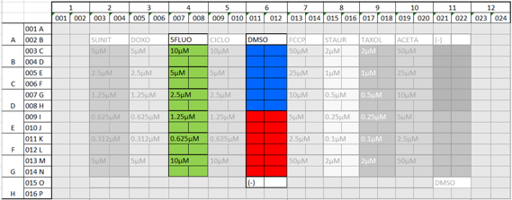


# Tox-RCNN

Here we describe how to train and test Py-Faster-RCNN on cytotoxicity datasets.


## Install py-faster-rcnn

First you need clone and test the regular py-faster-rcnn repository from rbgirshick.

```
$ git clone https://github.com/rbgirshick/py-faster-rcnn
```

We will refer to the root directory with *$PY_FASTER_RCNN.*

You will also need to follow the installation steps from [the original py-faster-rcnn readme](https://github.com/rbgirshick/py-faster-rcnn/blob/master/README.md)

## Format the Dataset

We use this common architecture for every dataset in _$PY_FASTER_RCNN/data_
```
cytotoxicity_devkit/  
|-- data/  
	|-- Annotations/  
		|-- *.xml (Annotation files)  
	|-- Images/  
		|-- *.tiff (Image files)  
	|-- ImageSets/  
		|-- train.txt
		|-- test.txt
```
A simple way to achieve it is to use symbolic links.

Annotations are in _xml_ format and have the following syntax:

```
<?xml version="1.0" encoding="utf-8"?>
<Annotations>
   <folder>data</folder>
   <filename>field.tif</filename>
   <size>
      <width>image_width</width>
      <height>image_height</height>
      <depth>number_of_image_channels</depth>
   </size>
   <object>
      <id>1</id>
      <name>TOXICITY_AFFECTED</name>
      <bndbox_cell>
         <xmin>x_top_left</xmin>
         <ymin>y_top_left</ymin>
         <xmax>x_bottom_right</xmax>
         <ymax>y_bottom_right</ymax>
      </bndbox_cell>   
   </object>
      <object>
      <id>2</id>
      <name>HEALTHY</name>
      <bndbox_cell>
         <xmin>x_top_left</xmin>
         <ymin>y_top_left</ymin>
         <xmax>x_bottom_right</xmax>
         <ymax>y_bottom_right</ymax>
      </bndbox_cell>   
   </object>
</Annotations>
```
First we have the information about the folder and file name and also image size information like image width, image height, number of channels. Then we have the coordinates of the obects' bounding boxes including top left *x* and *y*, and bottom right *x* and *y*, and the class (name) to which this bounding box is related.

## Add lib/datasets/cytotoxicity.py

You need to copy the provided cytotoxicity.py into _$PY_FASTER_RCNN/lib/datasets_

## Update lib/datasets/factory.py

You can rename the current file by clicking the file name in the navigation bar or by clicking the **Rename** button in the file explorer.

## Adapt the network model

Make a new directory under _$PY_FASTER_RCNN/models/_ with the name _cytotoxicity_ and copy the provided _solver.prototxt_, _solver_transfer.prototxt_, _train.prototxt_, _test.prototxt_, and _train_transfer.prototxt_ into this directory.

## Launch the training

In the directory _$PY_FASTER_RCNN_, run the following command in the shell.
```
$ python ./tools/Tox_RCNN_train.py --gpu 0 --solver models/cytotoxicity/solver.prototxt --imdb cytotoxicity_train --iters [#iters] --cfg experiments/cfgs/faster_rcnn_end2end.yml --set RNG_SEED 42 TRAIN.SCALES "[400, 500, 600]"
```

 Where _#iters_ shows the number of iterations you want to use to train the network.
 
In case of transfer learning, you can execute the following command:
```
$ python ./tools/Tox_RCNN_train.py --gpu 0 --weights data/faster_rcnn_models/[pretrained_model_name].caffemodel --solver models/cytotoxicity/solver_transfer.prototxt --imdb cytotoxicity_train --iters [#iters] --cfg experiments/cfgs/faster_rcnn_end2end.yml --set RNG_SEED 42 TRAIN.SCALES "[400, 500, 600]"
```
where _pretrained_model_name_ shows name of the pretrained model.

## Launch the testing

After training the model, you can find the models for each 10,000 iterations and the final model in *\$PY_FASTER_RCNN/output/faster_rcnn_end2end/train*. You should copy the final model into *\$PY_FASTER_RCNN/data/faster_rcnn_models* and then execute the following command:
```
$ python ./tools/Tox_RCNN_test.py --output [output_csv_file] --net [net_path]
```
where *output_csv_file* shows the path and filename of output csv table with predictions for detected boundig boxes.

Note that, the test is done on the images annotated in _$PY_FASTER_RCNN/data/cytotoxicity_devkit/data/ImageSets/test.txt_. 

## Example
An example is provided to test the tool. It corresponds to a part of a toxicity-screening plate containing fluorescent images of cells labeled with DAPI under three diferent conditions
- Untreated cells
- DMSO
- Cells treated with 5FLUO drug at different concentrations
# 

Files provided:
- Data: _$PY_FASTER_RCNN/data/cytotoxicity_devkit.zip_:
	- Images: (data/cytotoxicity_devkit/data) all *.tif images
	- Annotations: all image-annotations (*xml files)
	- ImageSets: two .txt files for the selection of images used for training (all) or test (a subset).
- Models: _$PY_FASTER_RCNN/data/faster_rcnn_models.zip_

